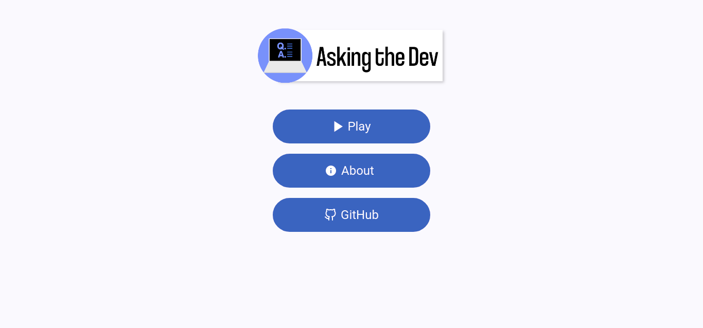
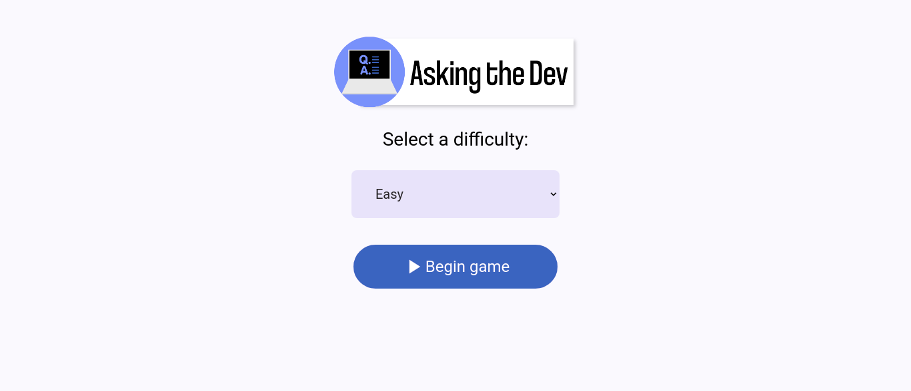
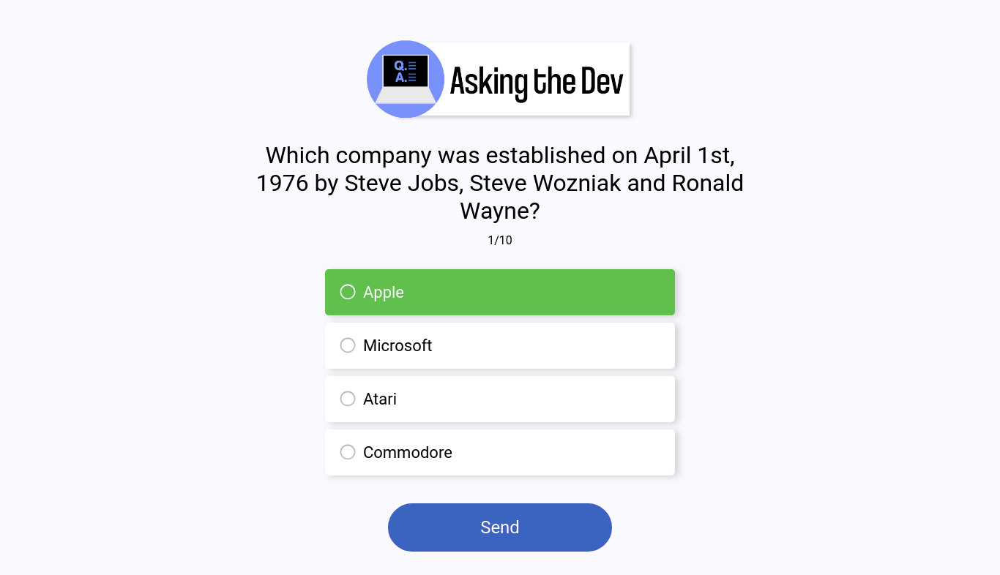
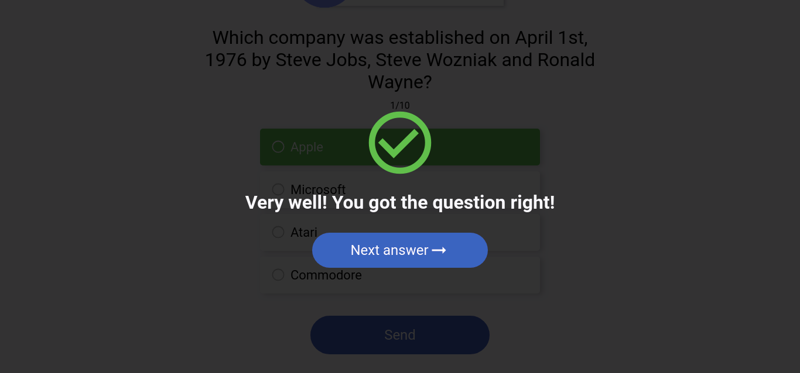
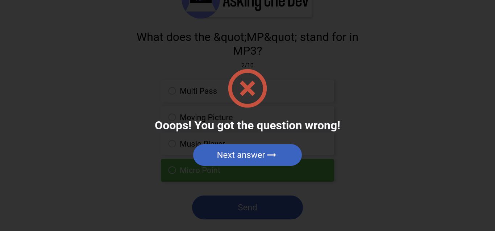
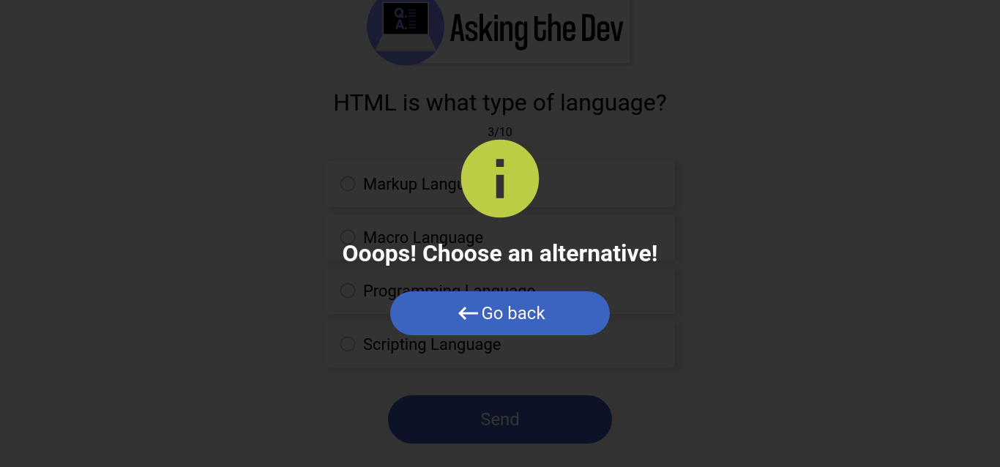
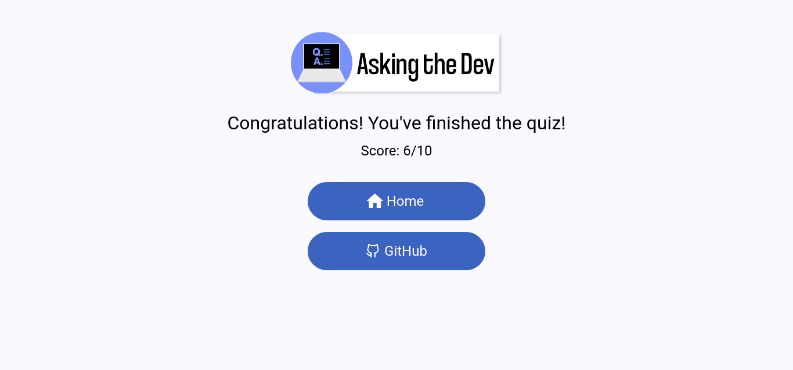

<h1>Asking the Dev</h1>

<p>Asking the Dev is a client of the Open Trivia DB with programming questions.</p>

<h2>The knowledge that I got and (or) practiced with this project:</h2>
<ul>
    <li>
        <p>ReactJS</p>
        <ul>
            <li>Context API (new knowledge)</li>
            <li>useState (practice)</li>
            <li>useEffect (practice)</li>
            <li>useRef (new knowledge)</li>
            <li>State change (new knowledge)</li>
            <li>BrowserRouter (practice)</li>
        </ul>
    </li>    
</ul>

<ul>
    <li>SASS (practice)</li>
    <li>How to consume a public API (practice)</li>
    <li>SVG Manipulation (practice)</li>
    <li>Object Literal pattern (practice)</li>
</ul>

<h2>Run in your machine:</h2>
<p>Note: it requires NPM installed</p>

```console
$ git clone https://github.com/ruifernandees/asking-the-dev.git
$ cd asking-the-dev
$ npm install
$ npm start
```

<h2>Screens:<h2>

<div>
    <p>Home Screen</p>
    
</div>

<div>
    <p>Question Setup Screen</p>
    
</div>

<div>
    <p>Question Screen</p>
    
</div>

<div>
    <p>Right Answer</p>
    
</div>

<div>
    <p>Wrong Answer</p>
    
</div>

<div>
    <p>No Answer</p>
    
</div>

<div>
    <p>End Screen</p>
    
</div>


